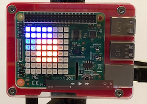

# Raspberry Sense Hat Demo
### Software for the [raspberry-xmas-tree project](https://github.com/seangreathouse/raspberry-xmas-tree) 

blinky_lights.py

At startup it displays a colored trail around a solid center.  

**Joystick inputs:**  
**Up:** Turns display off  
**Down:** Starts colored trail display  
**Right:** Cycles through different color sets for trail display  
**Left:** Starts text scroll  
**Center push:** Displays IP address in text scroll  
        *If wired and wireless connections are present, wired is displayed.*  
        *Ignores interfaces with self-assigned 169. addresses*

*Description of larger project:*  
As part of a CiCd demo I wanted to display a stack of Raspberry Pi's on stage.
The demonstration showed a CiCd pipeline deploying across the Raspberries and changing the colors of Sense Hat LED arrays on the devices.   
This repo contains the software deployed to the Raspberry Pi.  
A separate repo contains instructions for the [associated hardware project](https://github.com/seangreathouse/raspberry-xmas-tree). 

****

  
